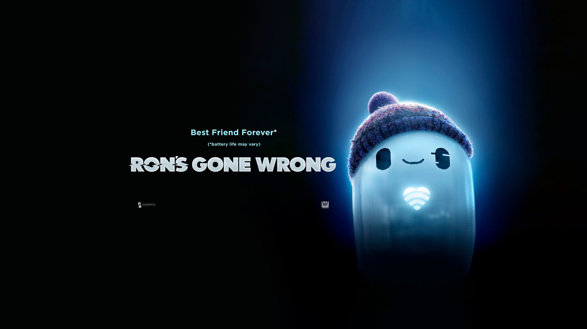

# About me

#### TL;DR

I am a software developer.

Working at [RodeoFX](https://rodeofx.com) as Senior Core Pipeline Developer.

Basically, making data flow and helping artists make pretty pixels.

Trying to design nice processes and workflows for the team !

You can learn more about my journey on my [LinkedIn](https://www.linkedin.com/in/victorfleury/) profile.

#### Technology I use and am familiar with : 

- Python
- Bash
- Qt/PySide
- USD
- Maya
- Nuke

#### Things I am interested in, and currently learning :

- Go
- Rust

## Places I have worked at

- [RodeoFX](https://rodeofx.com) in :canada:
- [DNEG](httpw://www.dneg.com) in :uk: and :canada:
- Various studios in :fr:

## Cool projects I have worked on 

#### Long story

I have been working in the VFX industry for over 10 years now and as a software developer for almost 10 years.

I have always been interested in understanding how things work and to do so I really love to take them apart, and look under the hood.
So naturally when I first got my hands on a computer, I became fascinated by it and how I could create my own programs.
I have fond memories of taking apart my parents old computer and trying to rebuild it back from scratch, and trying to install any Linux distros I could get my hands on (which was quite a challenge back then, cause no high speed broadband :smile: )

As long as I can remember, I have also been quite fond of cinema and VFX. 
As cliche as it sounds I really loved growing up and watching *Star Wars*, *Back to the future*, *Indiana Jones*, *Jurassic Park* and a lot more, and I think it gave me the movie fever.

When graduating from high school, I started a degree in computer science. Learned a lot, but in the end the lack of creativity and cinema pushed me towards a second degree in arts and technology.

There I learned all I could about DCCs (Maya, Nuke, Houdini, etc...) and a bit of programming as well.

